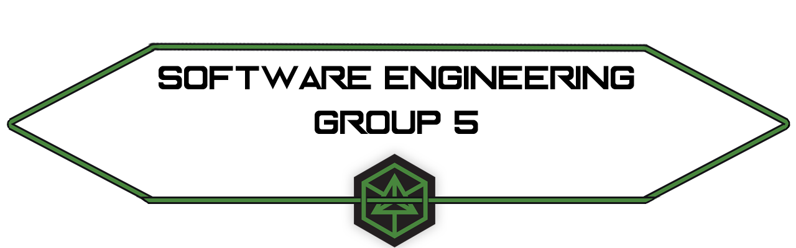

#  Repositorio IS Grupo 5

This repository contains all the created files for the Software Engineering practices. These files belong to **Group 5**.

### Table of Contents
**[Collaborators](#collaborators)** 
**[Practice 1 - Tutorials](#practice-1---tutorials)** 
**[Practice 2 - Requirements Analysis](#practice-2---requirements-analysis)** 
**[Practice 3 - System Design](#practice-3---system-design)** 
**[Practice 4 - Testing and Implementation](#practice-4---testing-and-implementation)** 

## Collaborators

This group is compounded by 3 students:
* [Molina Prieto, Francisco Javier **(Group leader)**](https://github.com/RexusWolf)
* [Prieto Barón, Álvaro](https://github.com/AdoenLunnae)
* [Muñoz Cubero, Antonio](https://github.com/ErTonix12)

## Practice 1 - Tutorials

In our first practice, we had to do tutorials of the things we learned in our first two practices (these are Git, Branches and Github) using Markdown, which we also learned in class.
In our case, we split the work so we could all have some practice on Markdown.

* [Git Tutorial](https://github.com/RexusWolf/IS/blob/master/Tutorials/tutorial_git.md)
* [Branches tutorial](https://github.com/RexusWolf/IS/blob/master/Tutorials/tutorial_branches.md)
* [Github tutorial](https://github.com/RexusWolf/IS/blob/master/Tutorials/tutorial_github.md)
* [All tutorials](https://github.com/RexusWolf/IS/blob/master/p1/p1.md)

## Practice 2 - Requirements Analysis

In our second practice, we had to create a software that manages a student database. This software would be used by the teacher to manage the student's teams in the practice classes.

* [Requirements](https://github.com/RexusWolf/IS/blob/master/Requirements/requirements.md)
* [Study Cases](https://github.com/RexusWolf/IS/tree/master/Requirements/casestudies)
* [User Stories](https://github.com/RexusWolf/IS/tree/master/Requirements/userstories)
* [Diagram](./Media/diagram.png)

## Practice 3 - System Design

In our third practice, we learned about Class Diagrams and Sequence Diagrams, two types of UML structure diagram. We had to make our own class diagram and a sequence diagrams for each user case. Also, we did a brief explanation of these diagrams in Markdown.

* [Class Diagram Explanation](https://github.com/RexusWolf/IS/tree/master/System_Design/ClassDiagram.md)
* [Sequence Diagram Explanation](https://github.com/RexusWolf/IS/tree/master/System_Design/SequenceDiagram.md)
* [Diagrams](https://github.com/RexusWolf/IS/tree/master/System_Design/Diagrams)

## Practice 4 - Testing and Implementation

In our fourth and...sadly...last practice, we're going to work together as a Scrum Team (or at least we'll try) and finish our project, working on the implementation and testing of it.

* [What is Scrum?](https://github.com/RexusWolf/IS/tree/master/Implementation/SCRUM/WhatIsSCRUM.md)
