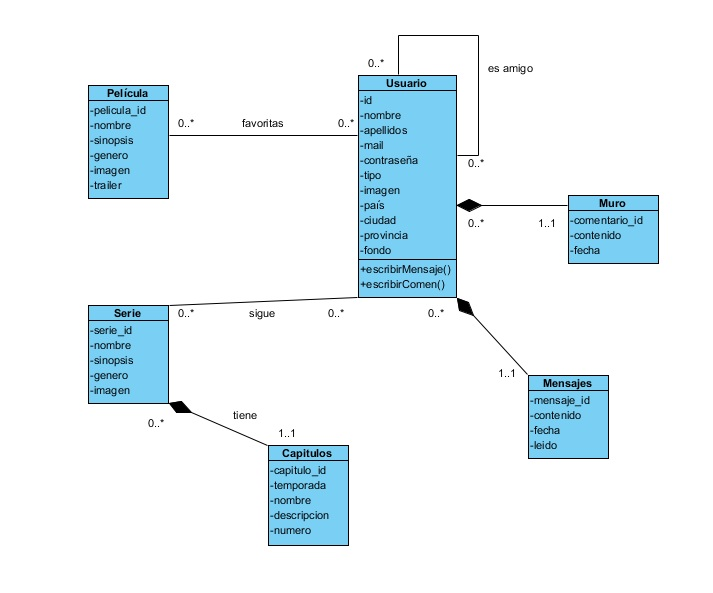

# **Class Diagrams**

Here's a fast explanation of what is a Class Diagram and how it works.

In **software engineering**, a *class diagram* in the Unified Modeling Language (UML) is a type of static structure diagram that describes the structure of a system by showing the system's classes, their attributes, operations (or methods), and the relationships among objects.

## RELATIONSHIPS

1. **Dependency**: A dependency is a semantic connection between dependent and independent model elements.[5] It exists between two elements if changes to the definition of one element (the server or target) may cause changes to the other (the client or source). This association is uni-directional.

2. **Association**: An association represents a family of links. A binary association (with two ends) is normally represented as a line. An association can link any number of classes. An association with three links is called a ternary association.

3. **Aggregation**: Aggregation is a variant of the "has a" association relationship; aggregation is more specific than association. It is an association that represents a part-whole or part-of relationship. As shown in the image, a Professor 'has a' class to teach.

4. **Composition**: The UML representation of a composition relationship shows composition as a filled diamond shape on the containing class end of the lines that connect contained class(es) to the containing class.

###  Example

