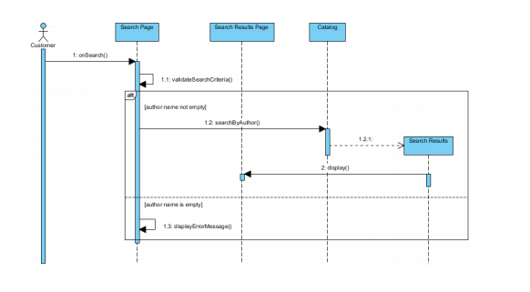

# **Sequence Diagrams**

Here's a fast explanation of what is a Sequence Diagram and how it works.

*Sequence diagrams* are a **type of UML structure diagram**, as the Class Diagrams.
They are a popular dynamic modeling solution in UML because they specifically focus on **lifelines**, or the processes and objects that live simultaneously, and the messages exchanged between them to perform a function before the lifeline ends.

## Advantages of Sequence Diagrams
* Represent the **details of a UML use case**.
* Model the logic of a **sophisticated** procedure, function, or operation.
* See how objects and components **interact with each other** to complete a process.
* Plan and understand the **detailed** functionality of an existing or future scenario.

## Structure of Sequence Diagrams

The main structure of a Sequence Diagram is composed by:

* **Class Role**: Describes the behavior of an object.
* **Activation**: Represents the time an object needs to make an action.
* **Lifelines**: The main part of a Sequence Diagram. Indicate an object presence.
* **Messages**: Show the interactions between objects.

Here's an example of a Sequence Diagram, in which the user wants to *Search a book by its author*.

